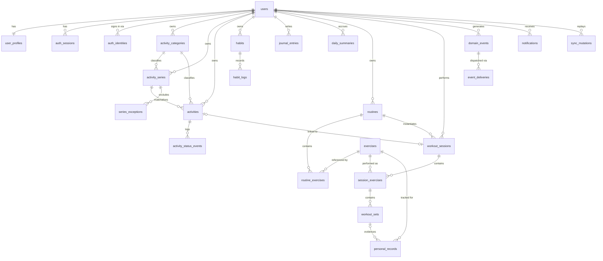

# Daybook Ecosystem: Database Design

**Status:** Phase 1 proposal
**Engine:** PostgreSQL 16
**Migrations:** Prisma Migrate, checked in, forward-only

---

## 1. Modelling principles

**Plan, occurrence and actual are three different things.** A recurring "Gym, Mon/Wed/Thu/Sat at 18:00" is a *plan*. Wednesday the 3rd at 18:00 is an *occurrence*. Starting at 18:05 and finishing at 19:12 is the *actual*. Most planner apps collapse these and then cannot answer "how often do I start late", which is the analysis your brief asks for in §18. Here they are separate columns on separate concepts.

**Occurrences are materialised rows, not computed on the fly.** A background job expands each active series into concrete `activities` rows over a rolling 90 day horizon. Materialising costs storage that is irrelevant at this scale, and buys the ability to attach status, notes, actual times, reminders and sync links to a specific day, plus fast indexed queries for analytics. A read-time fallback expands lazily if the job ever falls behind.

**Every user-owned table carries `user_id`,** even when reachable through a parent. This enables uniform row-level security and removes ownership joins from hot queries.

**Soft delete on user content** via `deleted_at`. Uniqueness constraints are partial: `where deleted_at is null`. Account deletion is a separate hard-delete path.

**Timezone rule.** Series store a wall-clock `start_time` plus an IANA `timezone`. Occurrences store absolute `timestamptz` values computed at materialisation. A series that says 07:00 stays at 07:00 across a daylight-saving change, which is what a human means, and the occurrence rows carry the correct absolute instants.

**Money-free, health-inference-free.** The schema stores what the user records. It does not store derived health judgements.

---

## 2. Entity relationship overview

---

## 3. Identity and account

### users
| Column | Type | Notes |
|---|---|---|
| id | uuid PK | `gen_random_uuid()` |
| email | citext UNIQUE NOT NULL | case-insensitive |
| password_hash | text | null when the account is social-only |
| email_verified_at | timestamptz | |
| status | text NOT NULL | `active`, `suspended`, `pending_deletion` |
| created_at / updated_at | timestamptz NOT NULL | |
| deleted_at | timestamptz | |

### user_profiles
`user_id uuid PK FK→users`, `display_name text`, `avatar_url text`, `timezone text NOT NULL default 'Europe/London'`, `locale text`, `week_start_day smallint NOT NULL default 1` (ISO, 1 = Monday), `preferred_wake_time time`, `preferred_sleep_time time`, `sleep_target_minutes int`, `weight_unit text` (`kg`/`lb`), `distance_unit text`, `theme text`, `default_workout_days smallint[]`.

Constraint: `timezone` validated against `pg_timezone_names` on write.

### user_preferences
`user_id uuid PK FK→users`, `score_weights jsonb NOT NULL` (see SCORING.md), `analytics_start_of_day time default '04:00'`, `notification_defaults jsonb`.

`analytics_start_of_day` matters: an activity at 01:00 belongs to the previous logical day for a night owl. One setting, applied consistently.

### notification_preferences
`user_id uuid PK`, `activity_reminders bool`, `activity_lead_minutes int default 10`, `habit_reminders bool`, `habit_reminder_time time`, `workout_reminders bool`, `wake_reminder bool`, `sleep_reminder bool`, `quiet_hours_start time`, `quiet_hours_end time`, `channels text[]` (`push`, `email`).

### auth_sessions
| Column | Type | Notes |
|---|---|---|
| id | uuid PK | |
| user_id | uuid FK→users ON DELETE CASCADE | |
| family_id | uuid NOT NULL | rotation lineage |
| refresh_token_hash | bytea NOT NULL UNIQUE | SHA-256 of the opaque token |
| issued_at / expires_at | timestamptz NOT NULL | |
| rotated_at | timestamptz | set when superseded |
| replaced_by | uuid FK→auth_sessions | |
| revoked_at | timestamptz | |
| revoked_reason | text | `logout`, `rotation`, `reuse_detected`, `password_change` |
| client | text | `daybook` or `fitness` |
| user_agent_hash / ip_hash | bytea | hashed, never raw, for anomaly detection only |

Indexes: `(user_id, expires_at)`, `(family_id)`.
Reuse detection: presenting a token whose `rotated_at` is not null revokes every row sharing its `family_id`.

### auth_identities

External sign-in methods attached to an account. One user can hold a password and a Google identity at once, and either can be added or removed without touching their data.

| Column | Type | Notes |
|---|---|---|
| id | uuid PK | |
| user_id | uuid FK→users ON DELETE CASCADE | |
| provider | text NOT NULL | `google`, later `apple` |
| provider_account_id | text NOT NULL | the provider's stable subject id, never the email |
| email_at_provider | citext | recorded for support, never used for matching |
| linked_at / last_login_at | timestamptz | |

Unique: `(provider, provider_account_id)`.
Index: `(user_id)`.

Matching is on `provider_account_id`, not on email, because a person can change the email on their Google account. Email is only ever used at the moment of first linking.

**Linking rule.** A Google login is auto-linked to an existing account with the same email only when the provider asserts `email_verified: true`. Otherwise the user must sign in with their password first and link from inside the account. Skipping this allows a pre-registration hijack: someone registers an unverified account at your address, waits, and inherits it when you later sign in with Google.

**Unlink guard.** Removing the last sign-in method is rejected. An account must always retain either a password or one identity.

### password_reset_tokens / email_verification_tokens
`id uuid PK`, `user_id uuid FK`, `token_hash bytea UNIQUE`, `expires_at timestamptz`, `used_at timestamptz`, `created_at`. Reset tokens live 30 minutes, single use, and invalidate all `auth_sessions` for that user on redemption.

---

## 4. Daybook domain

### activity_categories
`id uuid PK`, `user_id uuid FK` (nullable: null rows are the seeded system set), `name text NOT NULL`, `color text NOT NULL`, `icon text`, `is_system bool default false`, `sort_order int`, `created_at`, `deleted_at`.

Unique: `(user_id, lower(name)) where deleted_at is null`.
Seeded system categories: Routine, Work, Study, Fitness, Meals, Rest, Personal, Admin.

### activity_series
The recurring definition.

| Column | Type | Notes |
|---|---|---|
| id | uuid PK | |
| user_id | uuid FK NOT NULL | |
| title | text NOT NULL | |
| description | text | |
| category_id | uuid FK→activity_categories | |
| priority | smallint NOT NULL default 2 | 1 low, 2 medium, 3 high, 4 critical |
| rrule | text NOT NULL | RFC 5545 RRULE string |
| timezone | text NOT NULL | IANA, copied from profile at creation |
| start_date | date NOT NULL | |
| end_date | date | null = open ended |
| start_time | time NOT NULL | wall clock in `timezone` |
| duration_minutes | int NOT NULL CHECK > 0 | |
| reminder_lead_minutes | int | null = no reminder |
| is_active | bool NOT NULL default true | |
| materialised_through | date | horizon watermark |
| created_at / updated_at / deleted_at | timestamptz | |

Index: `(user_id, is_active) where deleted_at is null`.

Storing an RFC 5545 RRULE rather than a bespoke recurrence format means the `rrule` library handles the edge cases, and an iCalendar export in a later phase is close to free.

### series_exceptions
`series_id uuid FK`, `occurrence_date date`, `kind text` (`cancelled`, `detached`), `created_at`. Primary key `(series_id, occurrence_date)`.

Prevents the materialiser from resurrecting an occurrence the user deleted, and records that an occurrence has been edited away from its series so bulk series edits skip it.

### activities
The materialised occurrence, and the row the user actually interacts with.

| Column | Type | Notes |
|---|---|---|
| id | uuid PK | |
| user_id | uuid FK NOT NULL | |
| series_id | uuid FK→activity_series | null for one-off activities |
| occurrence_date | date NOT NULL | the logical day, in the user's timezone |
| title | text NOT NULL | |
| description | text | |
| category_id | uuid FK | |
| priority | smallint NOT NULL | |
| planned_start | timestamptz NOT NULL | |
| planned_end | timestamptz NOT NULL | CHECK `planned_end > planned_start` |
| planned_duration_minutes | int GENERATED | from the planned window |
| status | text NOT NULL default 'planned' | `planned`, `active`, `completed`, `partial`, `skipped`, `missed`, `rescheduled` |
| completion_ratio | numeric(3,2) | 0.00 to 1.00, defaults by status |
| actual_start | timestamptz | |
| actual_end | timestamptz | |
| actual_duration_minutes | int | accumulated across pauses, so it is not simply end minus start |
| start_deviation_minutes | int GENERATED | actual_start minus planned_start |
| notes | text | |
| source | text NOT NULL default 'manual' | `manual`, `series`, `sync` |
| is_detached | bool default false | edited away from its series |
| manually_overridden | bool default false | blocks sync from changing status |
| workout_session_id | uuid FK→workout_sessions | the integration link |
| origin_event_id | uuid FK→domain_events | idempotency anchor for sync-created rows |
| reminder_sent_at | timestamptz | |
| created_at / updated_at / deleted_at | timestamptz | |

Indexes:
- `(user_id, occurrence_date) where deleted_at is null`: the timeline query
- `UNIQUE (series_id, occurrence_date) where deleted_at is null`: no duplicate materialisation
- `UNIQUE (origin_event_id) where origin_event_id is not null`: no duplicate sync rows
- `(user_id, status, occurrence_date)`: analytics
- `(user_id, planned_start) where status in ('planned','active')`: the reminder scheduler

Constraint: `actual_end >= actual_start` when both are present.

### activity_status_events
`id uuid PK`, `activity_id uuid FK`, `user_id uuid`, `from_status text`, `to_status text NOT NULL`, `at timestamptz NOT NULL`, `source text` (`user`, `sync`, `system`), `metadata jsonb`.

An append-only audit trail. It powers pause/resume duration accumulation, answers "when did this actually get marked done", and lets analytics be recomputed from scratch after a bug fix.

### habits
`id uuid PK`, `user_id uuid FK`, `name text`, `description text`, `category_id uuid FK`, `target_type text` (`binary`, `count`, `duration`), `target_value numeric`, `unit text`, `schedule_rrule text` (which days it is due; null = daily), `timezone text`, `reminder_time time`, `sort_order int`, `is_archived bool`, `created_at / updated_at / deleted_at`.

### habit_logs
`id uuid PK`, `habit_id uuid FK`, `user_id uuid`, `log_date date NOT NULL`, `value numeric`, `completed bool NOT NULL`, `source text`, `logged_at timestamptz`, `note text`.

Unique: `(habit_id, log_date)`. Index `(user_id, log_date)`.

Streaks are computed from `habit_logs` joined against the habit's due-day rule, not stored as a counter. A stored counter drifts the moment a user backfills a day; computing it is fast at this data volume and always correct. Current and longest streak are cached per habit in `daily_summaries` for dashboard reads.

### journal_entries
`id uuid PK`, `user_id uuid FK`, `entry_date date NOT NULL`, `body text`, `highlights text[]`, `lessons text`, `tags text[]`, `created_at / updated_at / deleted_at`.

Unique: `(user_id, entry_date) where deleted_at is null`.

### daily_summaries
Pre-computed roll-up, rebuilt whenever a day's data changes.

`user_id uuid`, `summary_date date`, PK `(user_id, summary_date)`, then: `planned_count int`, `completed_count int`, `partial_count int`, `skipped_count int`, `missed_count int`, `completion_pct numeric(5,2)`, `productive_minutes int`, `habits_due int`, `habits_completed int`, `workout_planned bool`, `workout_completed bool`, `workout_minutes int`, `median_start_deviation_minutes int`, `productivity_score numeric(5,2)`, `score_breakdown jsonb`, `computed_at timestamptz`.

`score_breakdown` holds each component's raw value, weight and contribution, so the UI can always show how a score was reached (brief §19: no opaque scores).

---

## 5. Fitness domain

### exercises
`id uuid PK`, `user_id uuid FK` (null = global library row), `name text NOT NULL`, `modality text` (`strength`, `cardio`, `bodyweight`, `mobility`), `primary_muscle text`, `secondary_muscles text[]`, `equipment text`, `instructions text`, `is_system bool`, `created_at / deleted_at`.

Unique: `(user_id, lower(name)) where deleted_at is null`. Seeded with roughly 150 common movements so a new user is not staring at an empty library.

### routines
`id uuid PK`, `user_id uuid FK`, `name text`, `description text`, `estimated_minutes int`, `notes text`, `is_archived bool`, `created_at / updated_at / deleted_at`.

### routine_exercises
`id uuid PK`, `routine_id uuid FK ON DELETE CASCADE`, `exercise_id uuid FK`, `position int NOT NULL`, `target_sets int`, `target_reps int`, `target_weight_kg numeric(6,2)`, `target_duration_seconds int`, `target_distance_m int`, `rest_seconds int`, `superset_group smallint`, `notes text`.

Unique: `(routine_id, position)`. Weight is stored in kilograms always; display units are a profile preference. Storing user-facing units in the database is a class of bug worth designing out.

### workout_sessions
| Column | Type | Notes |
|---|---|---|
| id | uuid PK | |
| user_id | uuid FK NOT NULL | |
| routine_id | uuid FK | null for a freestyle session |
| activity_id | uuid FK→activities | set when started from a Daybook slot |
| client_session_uuid | uuid | generated offline by the client |
| name | text | |
| status | text NOT NULL | `in_progress`, `completed`, `abandoned` |
| started_at / ended_at | timestamptz | |
| duration_seconds | int | excludes long pauses |
| total_sets / total_reps | int | denormalised on completion |
| total_volume_kg | numeric(10,2) | Σ (reps × weight) for strength sets |
| notes | text | |
| created_at / updated_at / deleted_at | timestamptz | |

Unique: `(user_id, client_session_uuid) where client_session_uuid is not null`: this is what makes an offline workout replay exactly once.
Indexes: `(user_id, started_at desc)`, `(user_id, status) where status = 'in_progress'`.

### session_exercises
`id uuid PK`, `session_id uuid FK ON DELETE CASCADE`, `user_id uuid`, `exercise_id uuid FK`, `position int`, `notes text`. Unique `(session_id, position)`.

### workout_sets
`id uuid PK`, `session_exercise_id uuid FK ON DELETE CASCADE`, `user_id uuid`, `set_number int NOT NULL`, `set_type text` (`working`, `warmup`, `drop`, `failure`), `reps int`, `weight_kg numeric(6,2)`, `duration_seconds int`, `distance_m int`, `rpe numeric(3,1)`, `rest_seconds int`, `completed bool NOT NULL default false`, `performed_at timestamptz`, `client_set_uuid uuid`.

Unique: `(session_exercise_id, set_number)` and `(user_id, client_set_uuid)`.

### personal_records
`id uuid PK`, `user_id uuid FK`, `exercise_id uuid FK`, `metric text` (`max_weight`, `est_1rm`, `max_reps`, `max_volume_session`, `best_time`, `best_distance`), `value numeric(10,2)`, `unit text`, `achieved_at timestamptz`, `workout_set_id uuid FK`, `session_id uuid FK`, `previous_value numeric(10,2)`.

Index: `(user_id, exercise_id, metric, achieved_at desc)`.

Records are appended, never updated, so PR history is a real timeline rather than a single current best. Estimated 1RM uses Epley (`w × (1 + reps/30)`), documented in the UI wherever it is shown, and only for sets of 12 reps or fewer where the formula is reasonable.

---

## 6. Integration, sync and notification

### domain_events
The transactional outbox. Written in the same transaction as the change that caused it.

| Column | Type | Notes |
|---|---|---|
| id | uuid PK | |
| user_id | uuid FK NOT NULL | |
| event_type | text NOT NULL | see SYNC.md catalogue |
| schema_version | smallint NOT NULL default 1 | |
| aggregate_type | text NOT NULL | `workout_session`, `activity`, `habit` |
| aggregate_id | uuid NOT NULL | |
| payload | jsonb NOT NULL | |
| occurred_at | timestamptz NOT NULL | when it happened for the user |
| recorded_at | timestamptz NOT NULL default now() | when the server accepted it |
| idempotency_key | text UNIQUE | client supplied or derived |
| source_app | text NOT NULL | `daybook`, `fitness`, `system` |

Indexes: `(user_id, occurred_at desc)`, `(aggregate_type, aggregate_id)`.

### event_deliveries
`event_id uuid FK`, `consumer text`, PK `(event_id, consumer)`, `status text` (`pending`, `processing`, `delivered`, `failed`, `dead`), `attempts int default 0`, `last_error text`, `next_attempt_at timestamptz`, `processed_at timestamptz`.

Index: `(status, next_attempt_at) where status in ('pending','failed')`: the dispatcher's only query.

The composite primary key is the idempotency guarantee: an event can be delivered to a given consumer once.

### sync_mutations
`id uuid PK`, `user_id uuid FK`, `client_mutation_id uuid NOT NULL`, `entity text`, `operation text`, `payload jsonb`, `received_at timestamptz`, `applied_at timestamptz`, `result jsonb`, `status text`.

Unique: `(user_id, client_mutation_id)`. A replayed offline mutation returns the stored result instead of applying twice.

### notifications
`id uuid PK`, `user_id uuid FK`, `type text`, `title text`, `body text`, `payload jsonb`, `scheduled_for timestamptz`, `sent_at timestamptz`, `read_at timestamptz`, `dismissed_at timestamptz`, `channel text`, `dedupe_key text`.

Unique: `(user_id, dedupe_key) where dedupe_key is not null`.
Index: `(scheduled_for) where sent_at is null`.

### push_subscriptions
`id uuid PK`, `user_id uuid FK`, `endpoint text UNIQUE`, `p256dh text`, `auth text`, `client text`, `created_at`, `last_used_at`, `failed_count int`.

### data_exports
`id uuid PK`, `user_id uuid FK`, `format text` (`json`, `csv`), `status text`, `requested_at`, `completed_at`, `object_key text`, `expires_at`. Export files are pre-signed, short-lived, and deleted after 7 days.

---

## 7. Migration and integrity strategy

- Migrations are forward-only and checked in. Every migration is reviewed for whether it locks a table; anything that would lock gets a two-step expand-then-contract plan.
- CI runs `prisma migrate diff` against the committed schema and fails on drift.
- Every foreign key is indexed. PostgreSQL does not do this automatically and the omission shows up as slow deletes.
- `updated_at` is maintained by a trigger, not by application code, so background jobs and raw SQL cannot bypass it.
- Seed data (system categories, exercise library) ships as an idempotent seed script keyed on stable slugs, safe to re-run.
- A nightly integrity job asserts invariants and reports violations rather than silently correcting them: no `activities` row whose `series_id` points at a deleted series, no `workout_sessions` stuck `in_progress` for more than 24 hours, no `event_deliveries` in `processing` for more than 15 minutes.
