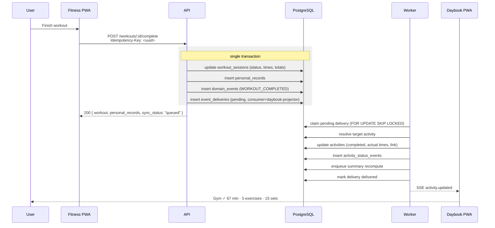

# Fitness → Daybook Synchronisation

**Status:** Phase 1 proposal

This is the feature the whole ecosystem exists for, so it gets its own document. The requirement from the brief (§11): the user finishes a workout in the Fitness app, and the Daybook activity "18:00 to 19:30 Gym" turns itself complete, with the real duration and set count attached, without the user entering anything twice.

---

## 1. The failure this design is built to avoid

The naive version writes the workout, then calls the Daybook service to update the activity. Two writes, no shared transaction. If the process dies between them, the workout exists and the Daybook slot still says "missed", and nothing in the system knows. Retrying blindly creates a second Daybook entry.

Everything below exists to make that impossible: one transaction, one durable event log, at-least-once delivery, and handlers that are safe to run twice.

---

## 2. The pipeline



The transactional outbox is the load-bearing idea. The event row is written by the same `COMMIT` that writes the workout. Either both exist or neither does. There is no window in which a workout is saved but its event was lost.

---

## 3. Event catalogue

All events share an envelope:

```jsonc
{
  "id": "01J9F2K4T6Q8...",
  "event_type": "WORKOUT_COMPLETED",
  "schema_version": 1,
  "user_id": "...",
  "aggregate_type": "workout_session",
  "aggregate_id": "...",
  "occurred_at": "2026-08-28T18:12:00Z",
  "recorded_at": "2026-08-28T18:12:01Z",
  "source_app": "fitness",
  "idempotency_key": "...",
  "payload": {},
}
```

| Event                | Emitted when                    | Consumers                                                      |
| -------------------- | ------------------------------- | -------------------------------------------------------------- |
| `WORKOUT_STARTED`    | a session is created            | daybook-projector (marks the activity `active`), notifications |
| `WORKOUT_COMPLETED`  | a session is finalised          | daybook-projector, summary-roll-up, records                    |
| `WORKOUT_ABANDONED`  | a session is abandoned          | daybook-projector (activity → `partial` or back to `planned`)  |
| `WORKOUT_UPDATED`    | a completed session is edited   | daybook-projector (re-projects), summary-roll-up               |
| `WORKOUT_DELETED`    | a session is soft-deleted       | daybook-projector (compensating: unlink and revert)            |
| `ACTIVITY_COMPLETED` | a Daybook activity is completed | summary-roll-up                                                |
| `ACTIVITY_SKIPPED`   | skipped or missed               | summary-roll-up                                                |
| `HABIT_COMPLETED`    | a habit is logged               | summary-roll-up, streaks                                       |
| `SLEEP_LOGGED`       | wake or sleep recorded          | summary-roll-up                                                |

`WORKOUT_COMPLETED` payload:

```jsonc
{
  "workout_session_id": "...",
  "routine_name": "Push Day",
  "activity_id": "...", // present when the workout was started from a Daybook slot
  "started_at": "2026-08-28T17:05:00Z",
  "ended_at": "2026-08-28T18:12:00Z",
  "duration_seconds": 4020,
  "exercise_count": 5,
  "total_sets": 15,
  "total_reps": 168,
  "total_volume_kg": 8420.5,
  "local_date": "2026-08-28",
  "timezone": "Africa/Lagos",
}
```

`local_date` and `timezone` travel inside the payload rather than being recomputed by the consumer. The consumer must not have to guess which day a 23:40 workout belongs to.

Events are versioned. A consumer reads `schema_version` and upcasts old shapes; events are never rewritten in place, because the log is also the audit trail and the rebuild source.

---

## 4. Matching a workout to a Daybook activity

The projector resolves a target in strict priority order and stops at the first hit.

**Rule 1: explicit link.** `payload.activity_id` is set because the user tapped "Start" on the Gym slot in Daybook, or the routine was scheduled through `POST /routines/:id/schedule`. This is unambiguous and needs no heuristics. The product design pushes users into this path wherever possible, because the best matching algorithm is the one you do not have to run.

**Rule 2: overlapping fitness-category activity.** On `payload.local_date`, find non-deleted activities whose category is fitness-flagged and whose planned window overlaps the actual workout window. If exactly one, that is the match. If several, take the one with the greatest overlap.

**Rule 3: nearest planned start.** Same date, fitness category, planned start within 120 minutes of `started_at`, status not already `completed`. Take the nearest. The window is generous on purpose: a workout planned for 18:00 and started at 19:30 is still that workout.

**Rule 4: no match.** Create a new activity on `local_date` with `source = 'sync'`, `status = 'completed'`, planned window equal to the actual window, and `origin_event_id` set to this event. An unplanned workout still belongs in the day's record. The UI marks it visibly as unplanned so the day's completion percentage is not quietly inflated: sync-created activities count toward "what happened" but are excluded from the "planned versus completed" denominator.

**The override guard.** If the matched activity has `manually_overridden = true`, the projector attaches the workout details and the link but does not change the status. A user who deliberately marked something skipped does not get overruled by a background job.

---

## 5. Idempotency, at every layer

Four independent guards, because this is the requirement most likely to produce a duplicate in production.

1. **HTTP.** `Idempotency-Key` on `POST /workouts/:id/complete`. A replay within 24 hours returns the stored response and emits nothing new.
2. **Event creation.** `domain_events.idempotency_key` is unique. For workout completion the key is derived as `workout_session_id + ':completed'`, so completing the same session twice cannot produce two events even if the HTTP key is absent.
3. **Delivery.** `event_deliveries` has primary key `(event_id, consumer)`. A given consumer gets a given event once. The dispatcher claims work with `SELECT ... FOR UPDATE SKIP LOCKED`, so two worker processes never take the same row.
4. **Projection.** The handler is an upsert, not an insert. Activity creation is keyed on the unique partial index over `origin_event_id`; activity updates are set to a target state rather than incremented. Running the handler ten times leaves exactly the same database as running it once.

The offline path adds a fifth: `workout_sessions.client_session_uuid` is unique per user, so a session created offline and replayed twice resolves to one row.

---

## 6. Retries and failure handling

| Attempt | Delay     |
| ------- | --------- |
| 1       | immediate |
| 2       | 5 s       |
| 3       | 30 s      |
| 4       | 2 min     |
| 5       | 10 min    |
| 6       | 1 h       |
| 7       | 6 h       |
| 8       | 24 h      |

Full jitter is applied to every delay. After attempt 8 the delivery moves to `dead`.

Errors are classified before retrying. A transient error (deadlock, connection loss, timeout) retries. A permanent error (referenced activity hard-deleted, malformed payload from an old client) goes straight to `dead` without burning eight attempts.

A dead delivery is not silent. It raises an alert, and the affected activity carries a `sync_issue` flag that the UI surfaces as a small, non-alarming "workout not linked, tap to link" affordance. The user can always resolve it manually, and doing so is one tap.

A stuck `processing` row (worker crashed mid-handler) is reclaimed by the nightly integrity job after 15 minutes and returned to `pending`. Because handlers are idempotent, reclaiming is safe.

---

## 7. Ordering and conflicts

Events are delivered at least once and are **not** guaranteed in order. The design does not need them to be.

- Each activity carries `last_synced_event_at`. The projector ignores an event whose `occurred_at` is older, so a delayed `WORKOUT_STARTED` arriving after `WORKOUT_COMPLETED` cannot revert a completed activity.
- Handlers set absolute state rather than applying deltas, so out-of-order delivery converges on the same result.
- User edits beat sync: `manually_overridden` blocks status changes from the projector, permanently, until the user clears it.
- Server-computed fields (totals, volume, records) always come from the server. Client-entered fields (notes, set values) take the newer `updated_at`.

Conflicts that cannot be resolved by rule are surfaced to the user with both versions rather than silently discarded. Silently losing a user's logged sets is worse than asking them a question.

---

## 8. Offline behaviour

Both apps queue writes in IndexedDB when offline. Each queued mutation carries a client-generated UUID.

**What is allowed offline:** activity status transitions, habit ticks, journal text, starting and logging a whole workout, completing a workout.

**What requires connectivity:** creating or editing recurring series, editing routines, account and security changes, exports. Merging those offline is real complexity for very little benefit, and the brief (§26) explicitly says not to build complicated offline architecture without clear value.

**Replay.** On reconnect the client `POST`s the queue to `/sync/mutations` in order. The server dedupes on `(user_id, client_mutation_id)` and returns a per-mutation result: `applied`, `duplicate`, or `conflict` with the current server state. The client then pulls `/sync/changes?since=<cursor>` to catch anything that changed elsewhere.

A workout completed offline emits its event at replay time, with `occurred_at` set to the real completion instant from the payload, not the replay instant. That is why `occurred_at` and `recorded_at` are separate columns: the analytics need when it happened, the operations need when we heard about it.

---

## 9. Extensibility

The event log is the integration surface for everything in §38 of the brief. Adding Apple Health, Google Calendar or a wearable means writing a producer that inserts into `domain_events` and a consumer row in `event_deliveries`. Neither the Daybook code nor the Fitness code changes.

Outbound webhooks, if ever needed, are just another consumer with an HTTP handler, inheriting the same retry and idempotency machinery for free.

---

## 10. How this gets proved, not claimed

Phase 9 does not ship until these tests pass, and the brief's rule 7 (do not claim something works unless it has been tested) is taken literally:

| Test        | Asserts                                                                                                                                      |
| ----------- | -------------------------------------------------------------------------------------------------------------------------------------------- |
| Unit        | matching rules 1 to 4 pick the right activity across 20 fixture scenarios, including overlaps, ties and midnight boundaries                  |
| Unit        | the projector is idempotent: applying the same event N times equals applying it once                                                         |
| Integration | the outbox row and the workout row commit or roll back together, verified by forcing a failure between them                                  |
| Integration | two concurrent workers never process the same delivery, verified with real parallel connections                                              |
| Integration | the retry ladder advances correctly and a permanent error skips to dead                                                                      |
| Integration | `manually_overridden` blocks a status change but still attaches workout detail                                                               |
| E2E         | plan a Gym slot, complete a workout in the Fitness app, assert the Daybook timeline shows completed with the real duration, within 5 seconds |
| E2E         | complete a workout with the network disabled, restore the network, assert exactly one Daybook update and no duplicate activity               |
| E2E         | deliver the same event twice by replaying it manually, assert one activity, one status event                                                 |
